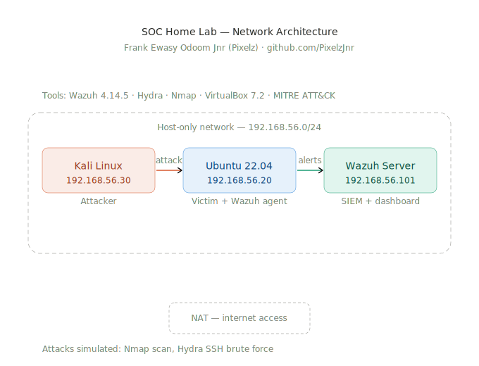
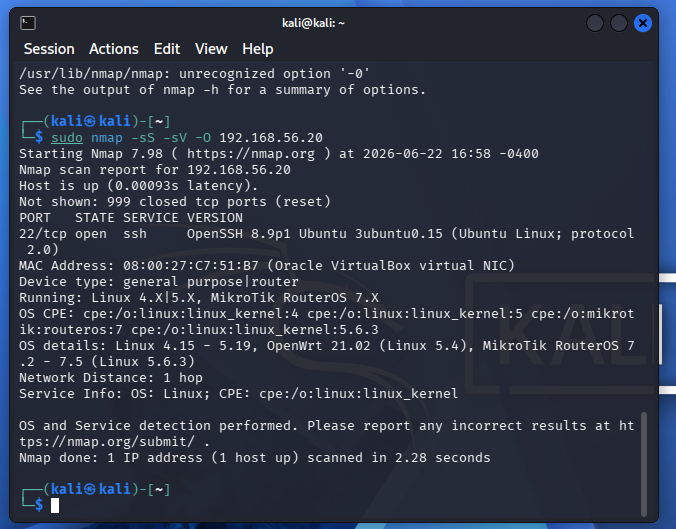
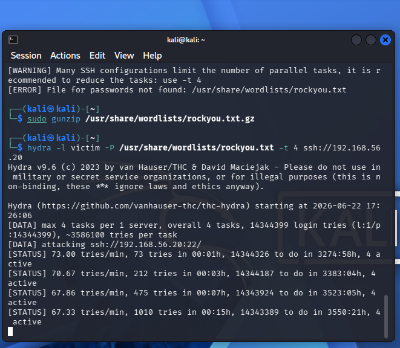
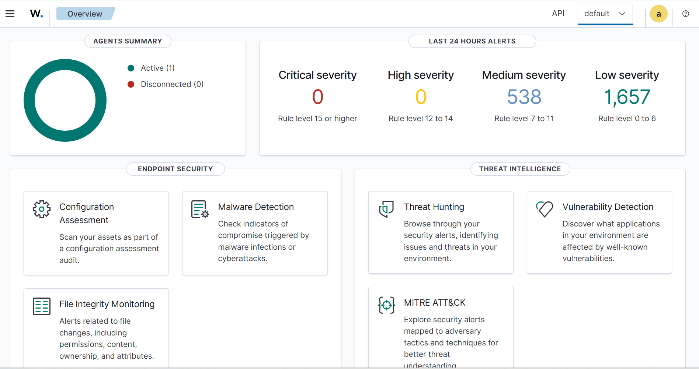
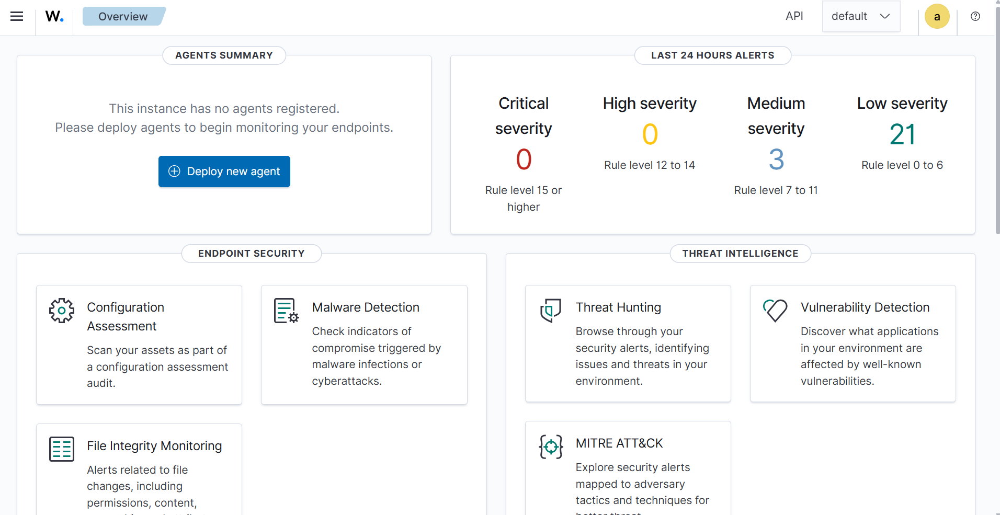
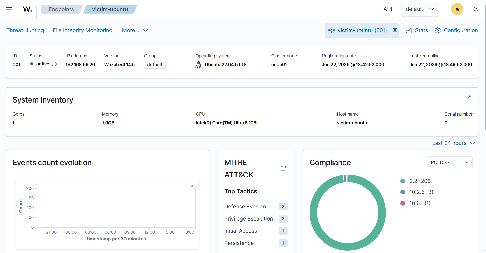

# SOC Home Lab — Real-Time Threat Detection with Wazuh

## Overview
A hands-on Security Operations Centre (SOC) home lab built to simulate real attacks and detect them in real time using Wazuh SIEM and Kali Linux.

## Network Architecture

## Lab Machines

| Machine | OS | IP | Role |
|---|---|---|---|
| Wazuh Server | Amazon Linux | 192.168.56.101 | SIEM + Manager |
| Victim | Ubuntu 22.04 | 192.168.56.20 | Target endpoint |
| Attacker | Kali Linux 2026.1 | 192.168.56.30 | Attack simulation |

## Tools Used
- Wazuh 4.14.5 (SIEM, XDR, threat detection)
- Hydra (SSH brute force simulation)
- Nmap (network reconnaissance)
- VirtualBox 7.2 (virtualisation)
- MITRE ATT&CK framework (alert classification)

## Attacks Simulated

### 1. Network Reconnaissance — Nmap

### 2. SSH Brute Force — Hydra

## Detections

- 538 medium severity alerts
- 1,657 low severity alerts
- MITRE ATT&CK tactics detected: Initial Access, Defense Evasion, Privilege Escalation, Persistence

## Wazuh Dashboard

## Agent Connected

## Author
Frank Ewasy Odoom Jnr (Pixelz)
[github.com/PixelzJnr](https://github.com/PixelzJnr)